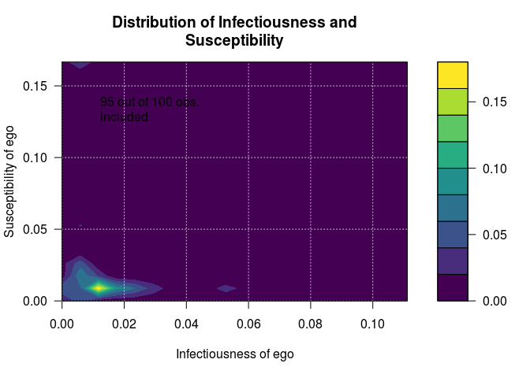
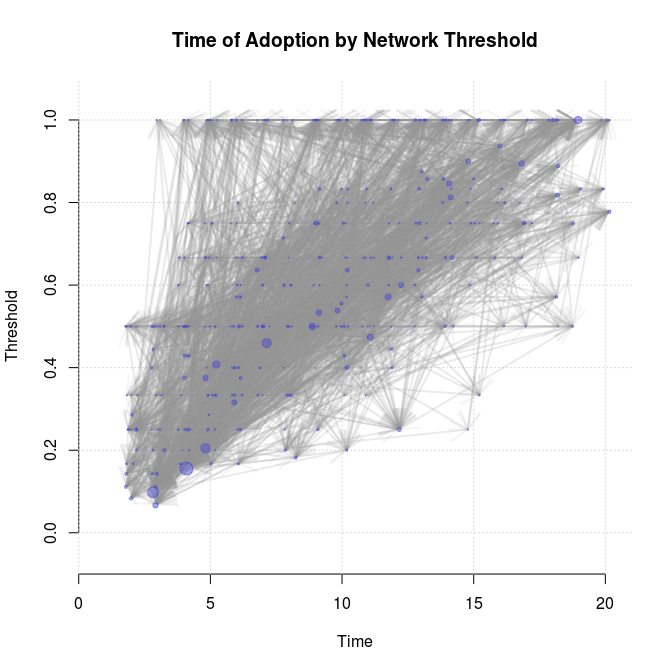
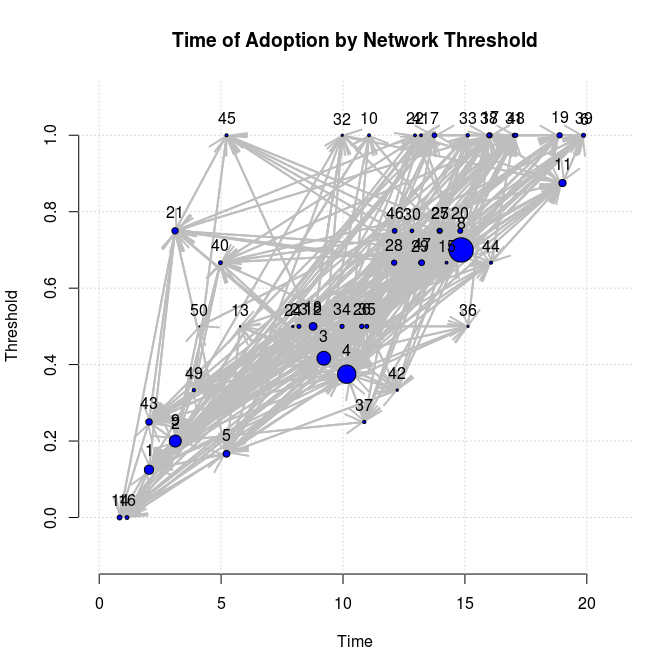
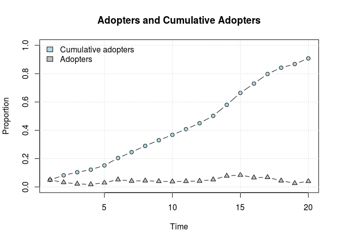
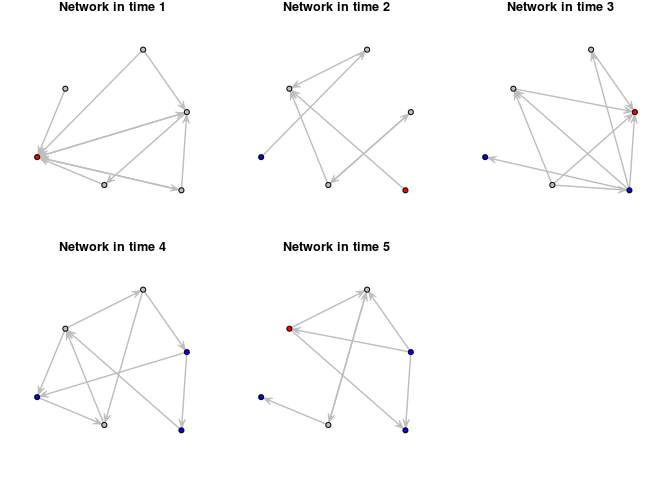

netdiffuseR: Network Analysis for Diffusion of Innovations
==========================================================

[](https://travis-ci.org/USCCANA/netdiffuseR) [](https://ci.appveyor.com/project/gvegayon/netdiffuser) [](https://codecov.io/github/USCCANA/netdiffuseR?branch=master)

This package contains functions useful for analyzing network data for diffusion of innovations applications.

The package was developed as part of the paper Thomas W. Valente, Stephanie R. Dyal, Kar-Hai Chu, Heather Wipfli, Kayo Fujimoto, *Diffusion of innovations theory applied to global tobacco control treaty ratification*, Social Science & Medicine, Volume 145, November 2015, Pages 89-97, ISSN 0277-9536 (available [here](http://www.sciencedirect.com/science/article/pii/S027795361530143X))

From the description: Statistical analysis, visualization and simulation of network diffusion of innovations. The package implements algorithms for calculating stats such as innovation threshold levels, infectiousness (contagion) and susceptibility, and hazard rates as presented in Burt (1987), Valente (1995), and Myers (2000) (among others).

Installation
------------

Infectiousness and Susceptibility

Using the `devtools` package, you can install `netdiffuseR` dev version as follows

``` r
devtools::install_github('USCCANA/netdiffuseR', build_vignettes = TRUE)
```

You can skip building vignettes by setting `build_vignettes = FALSE` (so it is not required).

For the case of OSX users, there seems to be a problem when installing packages depending on `Rcpp`. This issue, developed [here](https://github.com/USCCANA/netdiffuseR/issues/3), can be solved by open the terminal and typing the following

``` sh
curl -O http://r.research.att.com/libs/gfortran-4.8.2-darwin13.tar.bz2
sudo tar fvxz gfortran-4.8.2-darwin13.tar.bz2 -C /
```

before installing the package through `devtools`.

Examples
--------

This example has been taken from the package's vignettes:

``` r
library(netdiffuseR)
```

### Infectiousness and Susceptibility

``` r
# Generating a random graph
set.seed(1234)
n <- 100
nper <- 20
graph <- rgraph_er(n, nper, .5)
toa <- sample(c(1:(1+nper-1), NA), n, TRUE)
head(toa)
```

    ## [1] 20  7  9  1 17 14

``` r
# Creating a diffnet object
diffnet <- as_diffnet(graph, toa)
diffnet
```

    ## Dynamic network of class -diffnet-
    ##  # of nodes        : 100
    ##  # of time periods : 20
    ##  Adoption rate     : 0.95
    ##  Type              : directed

``` r
summary(diffnet)
```

    ## Diffusion network summary statistics
    ## -----------------------------------------------------------------------
    ##  Period  Adopters Cum Adopt. Cum Adopt. % Hazard Rate Density Moran's I 
    ## -------- -------- ---------- ------------ ----------- ------- --------- 
    ##        1        3          3         0.03           -    1.00     -0.01 
    ##        2        8         11         0.11        0.08    1.01     -0.01 
    ##        3        4         15         0.15        0.04    1.02     -0.00 
    ##        4        1         16         0.16        0.01    0.98     -0.01 
    ##        5        2         18         0.18        0.02    0.99     -0.01 
    ##        6        5         23         0.23        0.06    0.99     -0.01 
    ##        7        6         29         0.29        0.08    1.02     -0.01 
    ##        8        1         30         0.30        0.01    1.01     -0.01 
    ##        9        6         36         0.36        0.09    1.01     -0.01 
    ##       10        5         41         0.41        0.08    0.98     -0.01 
    ##       11        2         43         0.43        0.03    0.99     -0.02 
    ##       12        6         49         0.49        0.11    0.99     -0.01 
    ##       13        4         53         0.53        0.08    1.00     -0.01 
    ##       14        7         60         0.60        0.15    1.00     -0.01 
    ##       15        7         67         0.67        0.17    0.99     -0.01 
    ##       16        3         70         0.70        0.09    1.01     -0.01 
    ##       17       10         80         0.80        0.33    0.99     -0.01 
    ##       18        4         84         0.84        0.20    0.99     -0.01 
    ##       19        2         86         0.86        0.12    1.01     -0.01 
    ##       20        9         95         0.95        0.64    1.01     -0.01 
    ## -----------------------------------------------------------------------
    ##  Left censoring  : 0.03 (3)
    ##  Right centoring : 0.05 (5)

``` r
# Visualizing distribution of suscep/infect
out <- plot_infectsuscep(diffnet, bins = 20,K=5, logscale = TRUE)
```

    ## Warning in plot_infectsuscep.list(graph$graph, graph$toa, normalize, K, :
    ## When applying logscale some observations are missing.


 \#\#\# Threshold

``` r
# Generating a random graph
set.seed(123)
diffnet <- rdiffnet(50, 20, rgraph.args = list(m=4))
```

    ## Warning in rdiffnet(50, 20, rgraph.args = list(m = 4)): Less periods than
    ## wanted, only 8 instead of 20

``` r
# Threshold with fixed vertex size
plot_threshold(diffnet)
```



``` r
# Threshold with vertex size = avg degree
cex <- rowMeans(dgr(diffnet))
cex <- (cex - min(cex) + 1)/(max(cex) - min(cex) + 1)/2
plot_threshold(diffnet, vertex.cex = cex)
```


 \#\#\# Hazard rate

``` r
hazard_rate(diffnet)
```



### Diffusion process

``` r
plot_diffnet(diffnet, vertex.cex = 2)
```

    ## Loading required package: SparseM

    ## 
    ## Attaching package: 'SparseM'

    ## The following object is masked from 'package:base':
    ## 
    ##     backsolve



To-do list
----------

-   Import/Export functions for interfacing other package's clases, in particular: `statnet` set (specially the packages `networkDynamic` and `ndtv`), `igraph` and `Rsiena`.
-   Populate the tests folder.
-   Use spells? (`select_egoalter` would use this)
