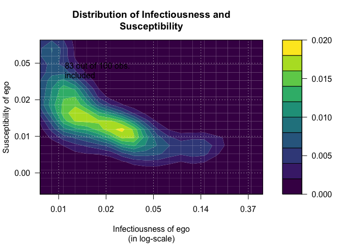
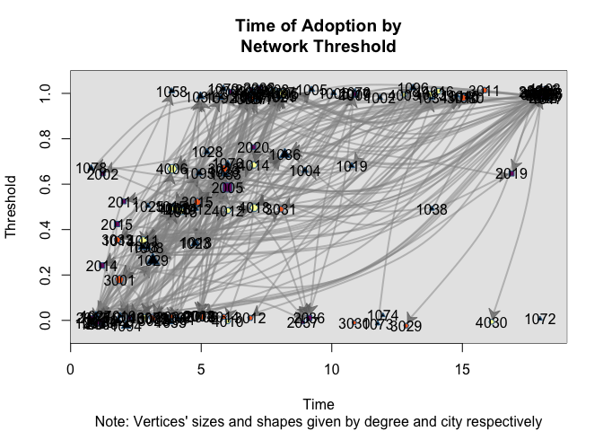
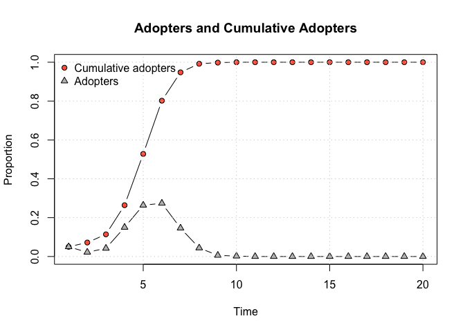
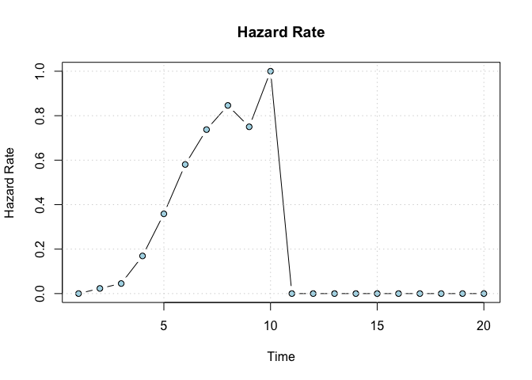
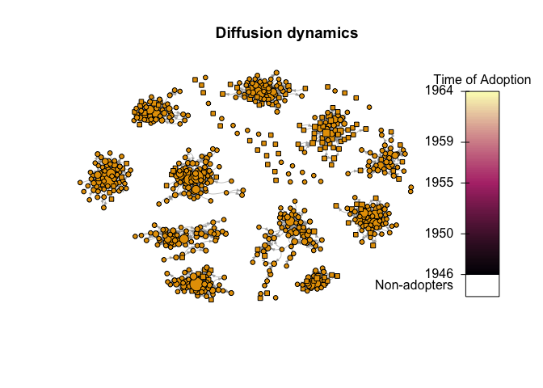

[](https://github.com/USCCANA/netdiffuseR/actions/workflows/r.yml)
[](https://app.codecov.io/github/USCCANA/netdiffuseR?branch=master)
[](https://cran.r-project.org/package=netdiffuseR)
[](https://cran.r-project.org/package=netdiffuseR)
[](https://cran.r-project.org/package=netdiffuseR)
[](https://doi.org/10.5281/zenodo.1039317)
[](https://cran.r-project.org/package=netdiffuseR)
[](https://pphs.usc.edu/center/cana/)

<h1>
netdiffuseR: Analysis of Diffusion and Contagion Processes on
Networks
</h1>

This package contains functions useful for analyzing network data for
diffusion of innovations applications.

The package was developed as part of the paper Thomas W. Valente,
Stephanie R. Dyal, Kar-Hai Chu, Heather Wipfli, Kayo Fujimoto,
*Diffusion of innovations theory applied to global tobacco control
treaty ratification*, Social Science & Medicine, Volume 145, November
2015, Pages 89-97, ISSN 0277-9536 (available
[here](https://www.sciencedirect.com/science/article/pii/S027795361530143X))

From the description:

> Empirical statistical analysis, visualization and simulation of
> diffusion and contagion processes on networks. The package implements
> algorithms for calculating network diffusion statistics such as
> transmission rate, hazard rates, exposure models, network threshold
> levels, infectiousness (contagion), and susceptibility. The package is
> inspired by work published in Valente, et al., (2015); Valente (1995),
> Myers (2000), Iyengar and others (2011), Burt (1987); among others.

**Acknowledgements**: netdiffuseR was created with the support of grant
R01 CA157577 from the National Cancer Institute/National Institutes of
Health.

``` r
citation(package="netdiffuseR")
```

    To cite netdiffuseR in publications use the following paper:

      Valente TW, Vega Yon GG. Diffusion/Contagion Processes on Social
      Networks. Health Education & Behavior. 2020;47(2):235-248.
      doi:10.1177/1090198120901497

    And the actual R package:

      Vega Yon G, Olivera Morales A, Valente T (2025). _netdiffuseR:
      Analysis of Diffusion and Contagion Processes on Networks_.
      doi:10.5281/zenodo.1039317 <https://doi.org/10.5281/zenodo.1039317>,
      R package version 1.23.0, <https://github.com/USCCANA/netdiffuseR>.

    To see these entries in BibTeX format, use 'print(<citation>,
    bibtex=TRUE)', 'toBibtex(.)', or set
    'options(citation.bibtex.max=999)'.

## News

Changelog can be view [here](NEWS.md).

## Installation

### CRAN version

To get the CRAN (stable) version of the package, simple type

``` r
install.packages("netdiffuseR")
```

### Bleeding edge version

If you want the latest (unstable) version of **netdiffuseR**, using the
`remotes` package, you can install `netdiffuseR` dev version as follows

``` r
remotes::install_github('USCCANA/netdiffuseR', build_vignettes = TRUE)
```

You can skip building vignettes by setting `build_vignettes = FALSE` (so
it is not required).

For the case of OSX users, there seems to be a problem when installing
packages depending on `Rcpp`. This issue, developed
[here](https://github.com/USCCANA/netdiffuseR/issues/3), can be solved
by open the terminal and typing the following

``` sh
curl -O http://r.research.att.com/libs/gfortran-4.8.2-darwin13.tar.bz2
sudo tar fvxz gfortran-4.8.2-darwin13.tar.bz2 -C /
```

before installing the package through `devtools`.

### Binary versions

For the case of windows and mac users, they can find binary versions of
the package [here](https://github.com/USCCANA/netdiffuseR/releases),
netdiffuseR_1…zip, and netdiffuseR_1…tgz respectively. They can install
this directly as follows (using the 1.16.3.29 version):

1.  Install dependencies from CRAN
    `r     > install.packages(c("igraph", "Matrix", "SparseM", "RcppArmadillo", "sna"), dependencies=TRUE)`

2.  Download the binary version and install it as follows:

    ``` r
    > install.packages("netdiffuseR_1.16.3.29.zip", repos=NULL)
    ```

    For windows users, and for Mac users:

    ``` r
    > install.packages("netdiffuseR_1.16.3.29.tgz", repos=NULL)
    ```

## Tutorials

Since starting netdiffuseR, we have done a couple of workshops at
Sunbelt and NASN. Here are the repositories:

- Sunbelt 2018: https://usccana.github.io/netdiffuser-sunbelt2018/
  ([source code](https://github.com/USCCANA/netdiffuser-sunbelt2018))
- NASN 2017: https://usccana.github.io/netdiffuser-nasn2017/ ([source
  code](https://github.com/USCCANA/netdiffuser-nasn2017))
- Sunbelt 2016: https://github.com/USCCANA/netdiffuser-sunbelt2016

## Presentations

- ic2s2 2016 Evanston, IL:
  https://github.com/USCCANA/netdiffuser-ic2s22016 (poster)
- useR! 2016 Stanford, CA:
  https://github.com/USCCANA/netdiffuser-user2016 (slides)
- useR! 2016: https://github.com/USCCANA/netdiffuser-user2016

## Examples

This example has been taken from the package’s vignettes:

``` r
library(netdiffuseR)
```


    Attaching package: 'netdiffuseR'

    The following object is masked from 'package:base':

        %*%

### Infectiousness and Susceptibility

``` r
# Generating a random graph
set.seed(1234)
n <- 100
nper <- 20
graph <- rgraph_er(n, nper, .5)
toa <- sample(c(1:(1+nper-1), NA), n, TRUE)
head(toa)
```

    [1] 16  3 14  3 13  5

``` r
# Creating a diffnet object
diffnet <- as_diffnet(graph, toa)
diffnet
```

    Dynamic network of class -diffnet-
     Name               : Diffusion Network
     Behavior           : Unknown
     # of nodes         : 100 (1, 2, 3, 4, 5, 6, 7, 8, ...)
     # of time periods  : 20 (1 - 20)
     Type               : directed
     Num of behaviors   : 1
     Final prevalence   : 0.95
     Static attributes  : -
     Dynamic attributes : -

``` r
summary(diffnet)
```

    Diffusion network summary statistics
     Name     :  Diffusion Network 
     Behavior : Unknown
    -----------------------------------------------------------------------------
     Period   Adopters   Cum Adopt. (%)   Hazard Rate   Density   Moran's I (sd)  
    -------- ---------- ---------------- ------------- --------- ---------------- 
           1          8         8 (0.08)             -      0.50 -0.01 (0.00)     
           2          3        11 (0.11)          0.03      0.50 -0.01 (0.00)     
           3          6        17 (0.17)          0.07      0.51 -0.01 (0.00)     
           4          3        20 (0.20)          0.04      0.49 -0.01 (0.00)     
           5          9        29 (0.29)          0.11      0.50 -0.01 (0.00)     
           6          5        34 (0.34)          0.07      0.50 -0.01 (0.00)     
           7          2        36 (0.36)          0.03      0.51 -0.01 (0.00)     
           8          3        39 (0.39)          0.05      0.50 -0.01 (0.00)     
           9          5        44 (0.44)          0.08      0.50 -0.01 (0.00)     
          10          1        45 (0.45)          0.02      0.49 -0.01 (0.00)     
          11          3        48 (0.48)          0.05      0.50 -0.01 (0.00)     
          12          6        54 (0.54)          0.12      0.50 -0.01 (0.00)     
          13          8        62 (0.62)          0.17      0.50 -0.01 (0.00)     
          14          9        71 (0.71)          0.24      0.50 -0.01 (0.00)     
          15          5        76 (0.76)          0.17      0.50 -0.00 (0.00) **  
          16          7        83 (0.83)          0.29      0.50 -0.01 (0.00)     
          17          5        88 (0.88)          0.29      0.49 -0.00 (0.00) *** 
          18          4        92 (0.92)          0.33      0.50 -0.01 (0.00)     
          19          1        93 (0.93)          0.12      0.50 -0.01 (0.00)     
          20          2        95 (0.95)          0.29      0.50 -0.01 (0.00)     
    ----------------------------------------------------------------------------- 
     Left censoring  : 0.08 (8) 
     Right centoring : 0.05 (5) 
     # of nodes      : 100

     Moran's I was computed on contemporaneous autocorrelation using 1/geodesic
     values. Significane levels  *** <= .01, ** <= .05, * <= .1.

``` r
# Visualizing distribution of suscep/infect
out <- plot_infectsuscep(diffnet, bins = 20,K=5, logscale = FALSE, h=.01)
```


``` r
out <- plot_infectsuscep(diffnet, bins = 20,K=5, logscale = TRUE,
                         exclude.zeros = TRUE, h=1)
```

    Warning in plot_infectsuscep.list(graph$graph, graph$toa, t0, normalize, : When
    applying logscale some observations are missing.



### Threshold

``` r
# Generating a random graph
set.seed(123)
diffnet <- rdiffnet(500, 20,
                    seed.nodes = "random",
                    rgraph.args = list(m=3),
                    threshold.dist = function(x) runif(1, .3, .7))
```

    The option -copy.first- is set to TRUE. In this case, the first graph will be treated as a baseline, and thus, networks after T=1 will be replaced with T-1.TRUE

``` r
diffnet
```

    Dynamic network of class -diffnet-
     Name               : A diffusion network
     Behavior           : Random contagion
     # of nodes         : 500 (1, 2, 3, 4, 5, 6, 7, 8, ...)
     # of time periods  : 20 (1 - 20)
     Type               : directed
     Num of behaviors   : 1
     Final prevalence   : 1.00
     Static attributes  : real_threshold (1)
     Dynamic attributes : -

``` r
# Threshold with fixed vertex size
plot_threshold(diffnet)
```


Using more features

``` r
data("medInnovationsDiffNet")
set.seed(131)
plot_threshold(
  medInnovationsDiffNet,
  vertex.color     = viridisLite::inferno(4)[medInnovationsDiffNet[["city"]]],
  vertex.sides     = medInnovationsDiffNet[["city"]] + 2,
  sub = "Note: Vertices' sizes and shapes given by degree and city respectively",
  jitter.factor = c(1,1), jitter.amount = c(.25,.025)
)
```

    Warning in (function (graph, expo, toa, include_censored = FALSE, t0 = min(toa,
    : -vertex.sides- will be coerced to integer.



### Adoption rate

``` r
plot_adopters(diffnet)
```



### Hazard rate

``` r
hazard_rate(diffnet)
```



### Diffusion process

``` r
plot_diffnet(medInnovationsDiffNet, slices=c(1,9,8))
```


``` r
diffnet.toa(brfarmersDiffNet)[brfarmersDiffNet$toa >= 1965] <- NA
plot_diffnet2(brfarmersDiffNet, vertex.size = "indegree")
```



``` r
set.seed(1231)

# Random scale-free diffusion network
x <- rdiffnet(1000, 4, seed.graph="scale-free", seed.p.adopt = .025,
                           rewire = FALSE, seed.nodes = "central",
                           rgraph.arg=list(self=FALSE, m=4),
                           threshold.dist = function(id) runif(1,.2,.4))

# Diffusion map (no random toa)
dm0 <- diffusionMap(x, kde2d.args=list(n=150, h=1), layout=igraph::layout_with_fr)

# Random
diffnet.toa(x) <- sample(x$toa, size = nnodes(x))

# Diffusion map (random toa)
dm1 <- diffusionMap(x, layout = dm0$coords, kde2d.args=list(n=150, h=.5))

oldpar <- par(no.readonly = TRUE)
col <- viridisLite::plasma(100)
par(mfrow=c(1,2), oma=c(1,0,0,0), cex=.8)
image(dm0, col=col, main="Non-random Times of Adoption\nAdoption from the core.")
image(dm1, col=col, main="Random Times of Adoption")
par(mfrow=c(1,1))
mtext("Both networks have the same distribution on times of adoption", 1,
      outer = TRUE)
```


``` r
par(oldpar)
```

### Adopters classification

``` r
out <- classify(kfamilyDiffNet, include_censored = TRUE)
ftable(out)
```

                   thr Non-Adopters Very Low Thresh. Low Thresh. High Thresh. Very High Thresh.
    toa                                                                                        
    Non-Adopters               0.00             0.00        0.00         0.00              0.00
    Early Adopters             0.00            14.04        8.40         0.57              0.29
    Early Majority             0.00             5.64       11.65         5.54              2.58
    Late Majority              0.00             1.34        5.06         6.21              2.96
    Laggards                   0.00             1.53        0.00         0.00             34.19

``` r
# Plotting 
oldpar <- par(no.readonly = TRUE)
par(xpd=TRUE)
plot(out, color=viridisLite::inferno(5), las = 2, xlab="Time of Adoption",
     ylab="Threshold", main="")

# Adding key
legend("bottom", legend = levels(out$thr), fill=viridisLite::inferno(5), horiz = TRUE,
       cex=.6, bty="n", inset=c(0,-.1))
```


``` r
par(oldpar)
```

### Session info

``` r
sessionInfo()
```

    R version 4.4.0 (2024-04-24)
    Platform: x86_64-pc-linux-gnu
    Running under: Ubuntu 22.04.4 LTS

    Matrix products: default
    BLAS:   /usr/lib/x86_64-linux-gnu/openblas-pthread/libblas.so.3 
    LAPACK: /usr/lib/x86_64-linux-gnu/openblas-pthread/libopenblasp-r0.3.20.so;  LAPACK version 3.10.0

    locale:
     [1] LC_CTYPE=en_US.UTF-8       LC_NUMERIC=C              
     [3] LC_TIME=en_US.UTF-8        LC_COLLATE=en_US.UTF-8    
     [5] LC_MONETARY=en_US.UTF-8    LC_MESSAGES=en_US.UTF-8   
     [7] LC_PAPER=en_US.UTF-8       LC_NAME=C                 
     [9] LC_ADDRESS=C               LC_TELEPHONE=C            
    [11] LC_MEASUREMENT=en_US.UTF-8 LC_IDENTIFICATION=C       

    time zone: Etc/UTC
    tzcode source: system (glibc)

    attached base packages:
    [1] stats     graphics  grDevices utils     datasets  methods   base     

    other attached packages:
    [1] netdiffuseR_1.23.0

    loaded via a namespace (and not attached):
     [1] Matrix_1.7-0          jsonlite_1.8.8        dplyr_1.1.4          
     [4] compiler_4.4.0        tidyselect_1.2.1      Rcpp_1.0.12          
     [7] networkLite_1.0.5     boot_1.3-30           yaml_2.3.8           
    [10] fastmap_1.2.0         lattice_0.22-6        coda_0.19-4.1        
    [13] R6_2.5.1              generics_0.1.3        MatchIt_4.5.5        
    [16] igraph_2.0.3          knitr_1.47            MASS_7.3-60.2        
    [19] backports_1.5.0       tibble_3.2.1          statnet.common_4.9.0 
    [22] pillar_1.9.0          rlang_1.1.4           utf8_1.2.4           
    [25] xfun_0.44             viridisLite_0.4.2     cli_3.6.2            
    [28] magrittr_2.0.3        network_1.18.2        digest_0.6.35        
    [31] grid_4.4.0            lifecycle_1.0.4       vctrs_0.6.5          
    [34] SparseM_1.83          sna_2.7-2             evaluate_0.24.0      
    [37] glue_1.7.0            fansi_1.0.6           rmarkdown_2.27       
    [40] tools_4.4.0           pkgconfig_2.0.3       networkDynamic_0.11.4
    [43] htmltools_0.5.8.1    

## To-do list

- Import/Export functions for interfacing other package’s clases, in
  particular: `statnet` set (specially the packages `networkDynamic` and
  `ndtv`), ~~`igraph`~~ and `Rsiena`.
- Populate the tests folder.
- ~~Use spells? (`select_egoalter` would use this)~~
- ~~Classify individuals by adoption category using early adopters,
  adopters, and laggards, and by threshold using very low, low, high and
  very high threshold (Valente 95’ p. 94).~~
- ~~Double check all functions using adjacency matrix values.~~
- ~~Remove dimnames from matrices and vectors. It is more efficient to
  use the ones stored in meta instead.~~
- Implement the Bass model
- ~~Include function to import survey data (as shown on the vignettes)~~
- Exposure based on Mahalanobis distances and also Roger Leenders on
  weighting exposure (internal note).
- (2016-03-30): use `xspline` for drawing polygons & edges.
- ~~(2016-04-04): Add more options to `exposure`, namely, `self` (so
  removes diagonal or not!).~~
- (2016-04-19): animal behaviorists.
- (2016-10-18): Review language throughout the manual (more than
  innovation).
- (2016-10-18): Evaluate and eventually use a standard graph format
  (`network` for instance?).
- (2016-10-18): Standarize graph plot methods (choose either
  statnet/igraph/own)
